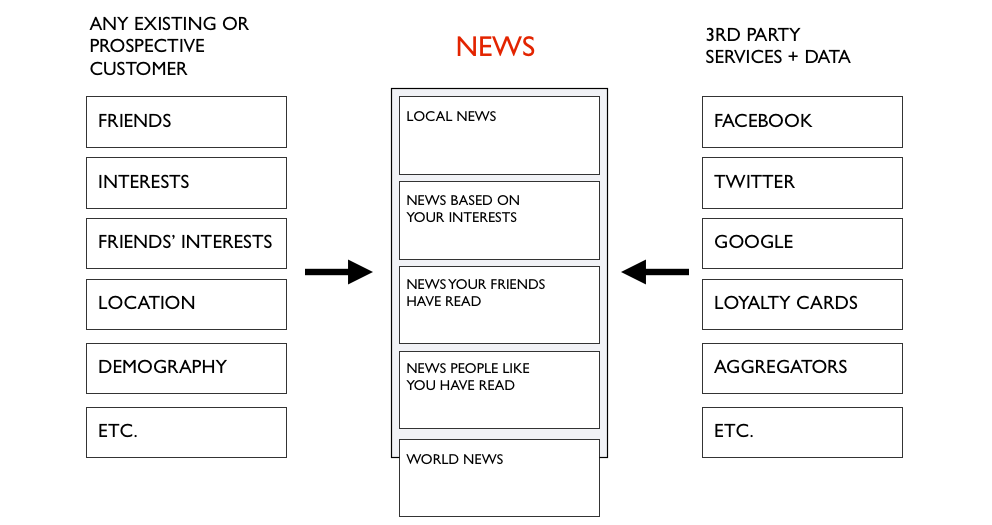
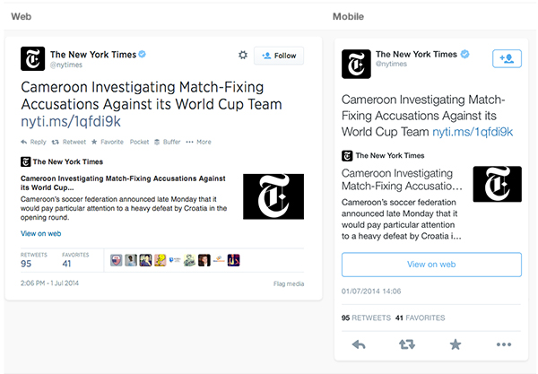
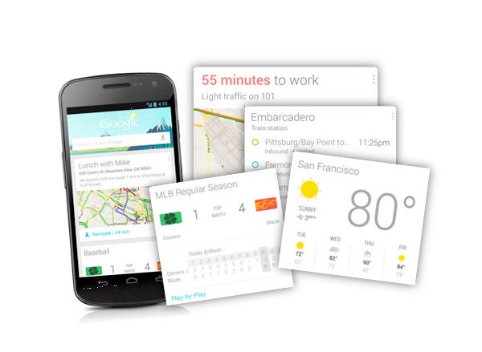
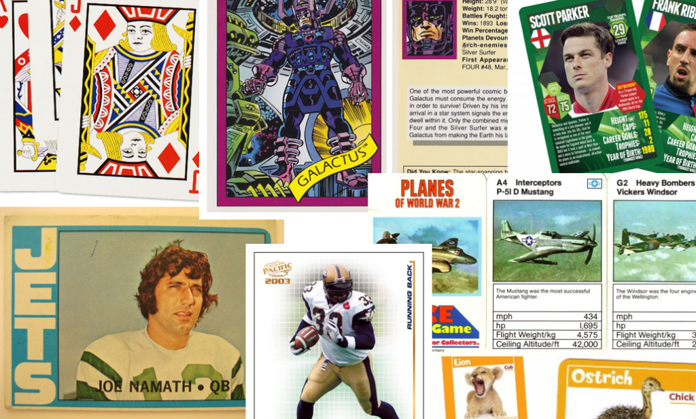
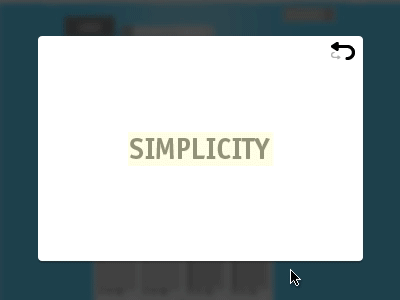
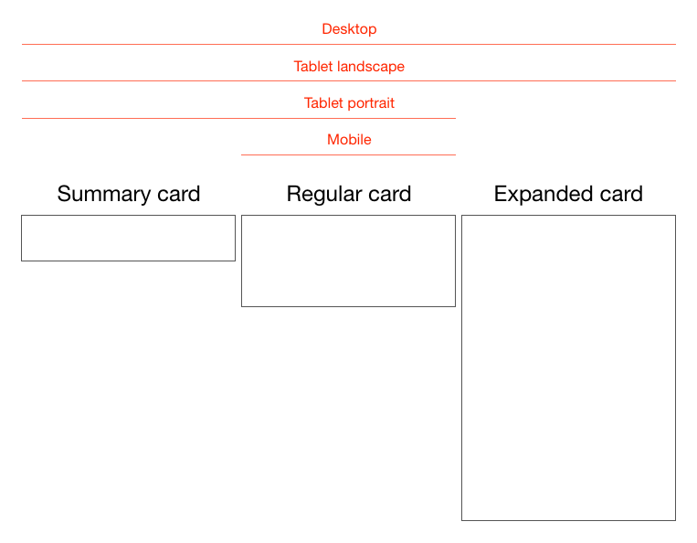

title: Why Cards Are the Future of the Web
source: https://medium.com/@intercom/why-cards-are-the-future-of-the-web-d3f6ce8b843a
accessed: 2015-02-02 23:18
author: Paul Adams
excerpt: Cards are fast becoming the best design pattern for mobile devices

We are currently witnessing a re-architecture of the web, away from pages and destinations, towards completely personalised experiences built on an aggregation of many individual pieces of content. Content being broken down into individual components and re-aggregated is the result of the rise of mobile technologies, billions of screens of all shapes and sizes, and unprecedented access to data from all kinds of sources through APIs and SDKs. This is driving the web away from many pages of content linked together, towards individual pieces of content aggregated together into one experience.

The aggregation depends on:

* The person consuming the content and their interests, preferences, behaviour.
* Their location and environmental context.
* Their friends’ interests, preferences and behaviour.
* The targeting advertising eco-system.

If the predominant medium of our time is set to be the portable screen (think phones and tablets), then the predominant design pattern is set to be cards. The signs are already here…

## Twitter Has Moved to Cards

Twitter introduced [Cards](https://dev.twitter.com/docs/cards) as a way to attached multimedia inline with tweets. Now the NYT should care more about how their story appears on the Twitter card (right hand in image above) than on their own web properties, because the likelihood is that the content will be seen more often in card format.

## Google Has Moved to Cards

With [Google Now](http://www.google.com/landing/now/), Google is rethinking information distribution, away from search, to personalised information pushed to mobile devices. Their design pattern for this is [cards](https://support.google.com/websearch/topic/2839478?hl=en&ref_topic=2847903).

## Cards Give Bursts of Information

Cards as an information dissemination medium have been around for a very long time. Imperial China used them in the 9th century for games. Trade cards in 17th century London helped people find businesses. In 18th century Europe footmen of aristocrats used cards to introduce the impending arrival of the distinguished guest. For hundreds of years people have handed around business cards.

### Cards as an information dissemination medium have been around for a very long time.

My wallet is full of debit cards, credit cards, my driving licence card. During my childhood, I was surrounded by games with cards. Top Trumps, Pokemon, Panini sticker albums and swapsies. Monopoly, Cluedo, Trivial Pursuit.

Cards are a great medium for communicating quick stories. Indeed the great (and terrible) films of our time are all storyboarded using a card like format. Each card representing a scene. Card, Card, Card. Telling the story.

What about commerce? Cards are the predominant pattern for coupons. Circulars, sent out to hundreds of millions of people every week are a full page aggregation of many individual cards. People cut them out and stick them to their fridge for later.

## Cards Can Be Manipulated

In addition to their reputable past as an information medium, the most important thing about cards is that they are almost infinitely manipulatable. Look at the simple example left from [Samuel Couto](https://dribbble.com/samuelcouto). Think about cards in the physical world. They can be turned over to reveal more, folded for a summary and expanded for more details, stacked to save space, sorted, grouped, and spread out to survey more than one.

When designing for screens, we can take advantage of all these things. In addition, we can take advantage of animation and movement. We can hint at what is on the reverse, or that the card can be folded out. We can embed multimedia content, photos, videos, music. There are so many new things to invent here.

Cards are perfect for mobile devices and varying screen sizes. Remember, mobile devices are the heart and soul of the future of your business, no matter who you are and what you do. On mobile devices, cards can be stacked vertically, like an activity stream on a phone. They can be stacked horizontally, adding a column as a tablet is turned 90 degrees. They can be a fixed or variable height.

### I think there is no getting away from it. Cards are the next big thing in design and the creative arts.

## Cards Are the New Creative Canvas

It’s already clear product and interaction designers will heavily use cards. I think the same is true for marketers and creatives in advertising. As social media continues to rise, and continues to fragment into many services, taking up more and more of our time, marketing dollars will inevitably follow. The consistent thread through these services, the predominant canvas for creativity, will be card based. Content consumption on Facebook, Twitter, Pinterest, Instagram, Line, you name it, is all built on the card design metaphor.

I think there is no getting away from it. Cards are the next big thing in design and the creative arts. To me that’s incredibly exciting.